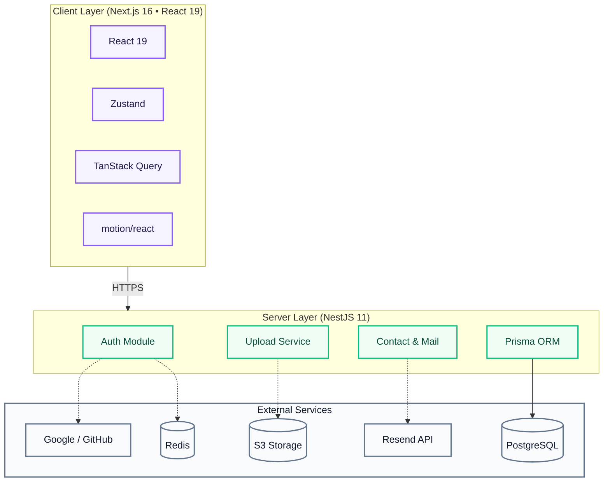

# Portfolio - Nuntawat Saehuam

[](https://www.typescriptlang.org/)
[](https://nextjs.org/)
[](https://nestjs.com/)
[](https://tailwindcss.com/)

Full-stack portfolio website built with **Next.js 16** and **NestJS 11**.

---

## 🎨 Design Approach

- **Feature-Sliced Architecture** — แยกโค้ดตาม domain (auth, contact, hero, skill ฯลฯ) ให้แต่ละ feature มี components, hooks, types ของตัวเอง
- **Server & Client Components** — ใช้ Server Components สำหรับ SEO และ Client Components สำหรับ interactive UI
- **GPU-Accelerated Animations** — ใช้ `motion/react` กับ `will-change: auto` cleanup เพื่อ performance ที่ดีที่สุด
- **Responsive & Accessible** — รองรับทุกขนาดจอ, dark/light mode, และ `prefers-reduced-motion`
- **Multilingual** — รองรับภาษาไทย (TH) และอังกฤษ (EN)

---

## 🏛️ System Architecture



---

## ⚡ Tech Stack

| Layer        | Technologies                                                                                     |
| :----------- | :----------------------------------------------------------------------------------------------- |
| **Frontend** | Next.js 16, React 19, Tailwind CSS 4, motion/react, Zustand, TanStack Query, Axios, Lucide Icons |
| **Backend**  | NestJS 11, Prisma ORM, Passport.js, JWT, Bcrypt, Resend API, S3 Storage, Redis                   |
| **Infra**    | PostgreSQL, Docker, pnpm workspace, TypeScript                                                   |

---

## 🚀 Getting Started

### Prerequisites

- Node.js v20+
- pnpm v9+
- Docker Desktop

### Installation

```bash
# 1. Clone
git clone <repository-url>
cd Portfolio-NextJS

# 2. Start database & services
cd backend
docker-compose up -d

# 3. Backend
cp .env.example .env    # แก้ไขค่า env ตามต้องการ
pnpm install
pnpm run start:dev      # http://localhost:3001

# 4. Frontend (เปิด terminal ใหม่)
cd ../frontend
pnpm install
pnpm dev                # http://localhost:3000
```

---

## 📝 License

This project is open-source and intended for educational and portfolio presentation purposes.
